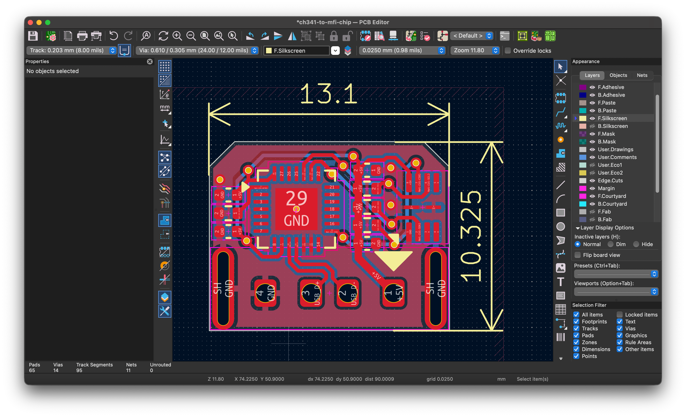
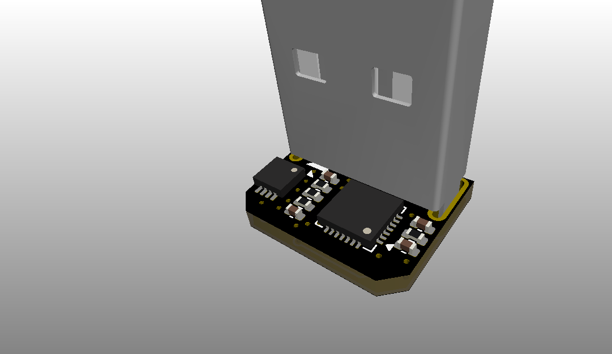

# ch341-to-mfi-chip

A CH341F to MFI337/341/343 board.

Tested works.

Check release. Pick the one fits you best from releases and make it.

Usage: [xcertplay](https://github.com/shilapi/xcertplay)

## Todo

Some crazy SKUs.

- [x] USBA-3.3v-CH341-MFI337 (tested, worked)
- [ ] USBC-3.3v-CH341-MFI337
- [ ] USBC-5v-CH341-MFI337
- [x] USBA-5v-CH341-MFI337 (not tested)
- [ ] USBA-3.3v-CH341-MFI343
- [ ] USBC-3.3v-CH341-MFI343
- [ ] USBA-5v-CH341-MFI343
- [ ] USBC-5v-CH341-MFI343
- [ ] USBA-3.3v-CH341-MFI341
- [ ] USBC-3.3v-CH341-MFI341
- [ ] USBA-5v-CH341-MFI341
- [ ] USBC-5v-CH341-MFI341

## Some crezy thing is also happening here

### The Ultra nano version of USBA-5v-CH341-MFI337

|      |      |
|------|------|
|| |

## Build

Check [production](production) for BOM and GERBER file.

## BOM

| No. | Model | Qty |
| ---: | --- | ---: |
| 1 | 10uF 0402 | 2 |
| 2 | 0.1uF 0402 | 3 |
| 3 | USB-212-BCW | 1 |
| 4 | 2kΩ 0402 | 1 |
| 5 | 2.2kΩ 0402 | 2 |
| 6 | 4.7kΩ 0402 | 1 |
| 7 | CH341F | 1 |
| 8 | HR1117V-3.3 | 1 |
| 9 | MFI337S3959 | 1 |
