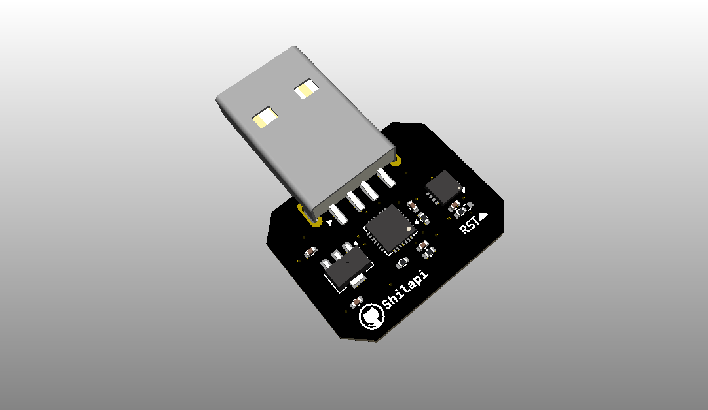

# ch341-to-mfi-chip

A CH341F to MFI337S3959 board.

Usage: [xcertplay](https://github.com/shilapi/xcertplay)

## Build

Check [production](production) for BOM and GERBER file.

## BOM

| No. | Model | Qty |
| ---: | --- | ---: |
| 1 | 10uF 0402 | 2 |
| 2 | 0.1uF 0402 | 3 |
| 3 | USB-212-BCW | 1 |
| 4 | 2kΩ 0402 | 1 |
| 5 | 2.2kΩ 0402 | 2 |
| 6 | 4.7kΩ 0402 | 1 |
| 7 | CH341F | 1 |
| 8 | HR1117V-3.3 | 1 |
| 9 | MFI337S3959 | 1 |
